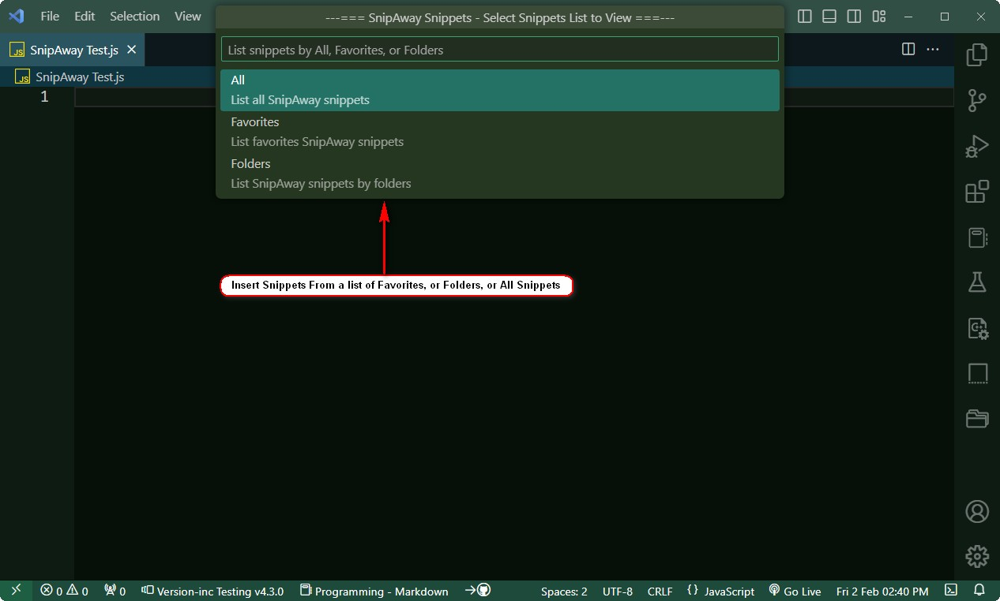
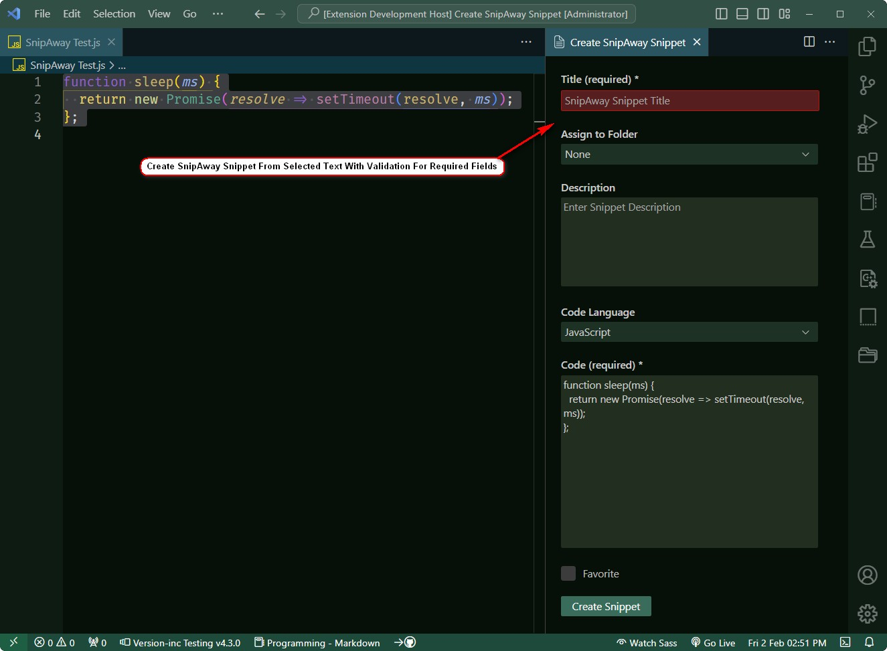
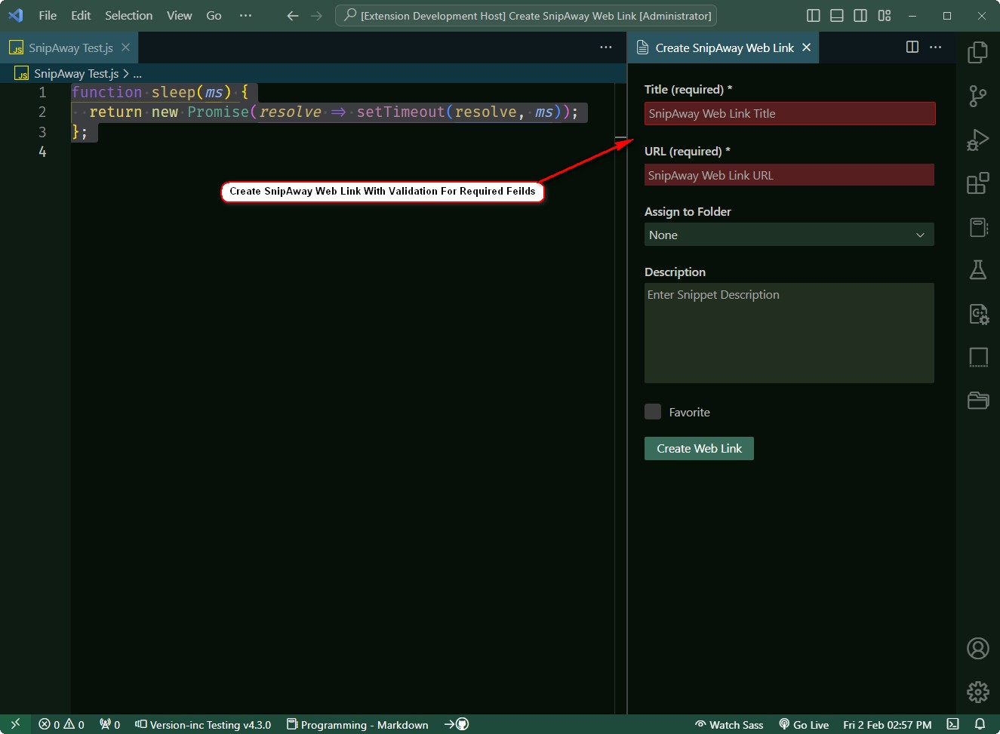
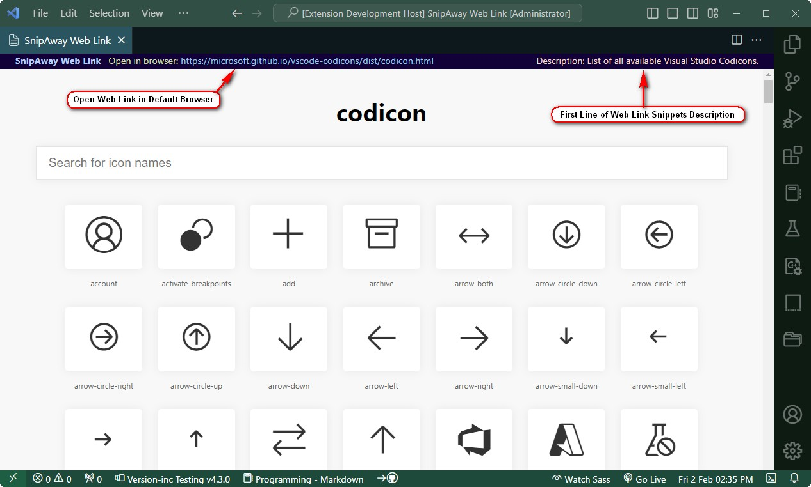

# SnipAway Snippets for Visual Studio Code

#### SnipAway is a customizable snippet manager made for developers and people who work with code. With features like advanced code editing, multiple themes, web snippets, folder tag system and more it has everything you need to work easily with your snippets. It also supports over 40+ programming languages and 25+ editor themes.

Access your [SnipAway](https://snipaway.futureglobe.de/) snippets from within Visual Studio Code.

This is an unofficial extension for the SnipAway snippet management software.

SnipAway is available for download from [https://snipaway.futureglobe.de/](https://snipaway.futureglobe.de/)

## Features
- Insert SnipAway snippets into your code files
- Create SnipAway snippets from selected text
- Create SnipAway Web Link's from within Visual Studio Code
- View SnipAway Web Link's from within Visual Studio Code
- Does not require SnipAway software to be opened first to access your snippets

## Screenshots

Insert SnipAway Snippet Screenshot...

Create SnipAway Snippet Screenshot...

Create SnipAway Web Link Snippet Screenshot...

View SnipAway Web Link Snippet Screenshot...

## Settings
### SnipAway Snippets - Snippets Folder
The folder location of your SnipAway snippets folder. The first time you try to insert a snippet you will be prompted with a browse for folder dialog asking for the location. You can also set this in your settings.json file.

## Commands
The following commands are available from the command pallette: (Windows: CTRL+Shift+P or F1) (Mac: CMD+Shift+P)
- SnipAway Snippets: Insert Snippet (Hotkey: ctrl+shift+alt+i)
- SnipAway Snippets: Create Snippet (Hotkey: ctrl+shift+alt+c)
- SnipAway Snippets: Create Web Link Snippet (Hotkey: ctrl+shift+alt+w)
- SnipAway Snippets: View Web Link Snippet (Hotkey: ctrl+shift+alt+v)

#### View Web Link Snippet Notes:
Not all web sites support being imbedded into Visual Studio Code's Webview iFrame. In those cases you can use the link on the page to open it in your default browser.

The description displayed at the top of the web link webview is taken from the first line of the SnipAway Snippets description for the snippet. Only the first 64 characters of the first lines text will be displayed.

## Release Notes
See the [Release Notes](RELEASE.md) for details.

